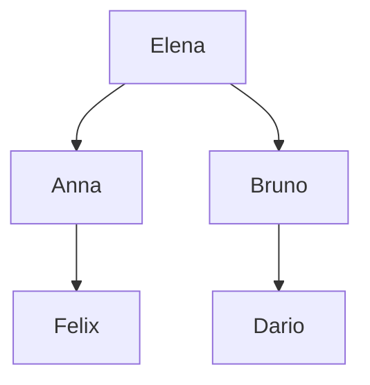

# Family Tree

This example builds a small family model step by step. Each step adds one
piece of FrameX logic: taxonomy, facts, derivation rules, property
declarations, and finally checks with `expect` and queries with `?-`.

Five people are enough to show everything: `elena` is the parent of the
siblings `anna` and `bruno`; `bruno` is the parent of `dario` and `anna` is
the parent of `felix`. That makes `dario` and `felix` cousins.

The family in one picture — solid arrows are the stated `hasParent` facts,
everything else on this page is derived from them:



## Step 1 — Declare the world and the taxonomy

Every complete program declares its [world](../syntax/world-assumption.md). Then define the classes:

```prolog
world open.

Person { hasName: String }.
Man extends Person.
Woman extends Person.
```

`Man` and `Woman` inherit from `Person`, so every `Man` or `Woman` is also a
`Person`. Membership shares the declared capability (`hasName`); it does not
share any individual's condition.

## Step 2 — Add the people

Objects use stable IDs. Display names are plain attributes and may collide;
IDs may not:

```prolog
elena : Woman.
anna : Woman.
bruno : Man.
dario : Man.
felix : Man.

elena[hasName -> "Elena"].
anna[hasName -> "Anna"].
bruno[hasName -> "Bruno"].
dario[hasName -> "Dario"].
felix[hasName -> "Felix"].
```

## Step 3 — State the parent facts

Only direct parents are stated. Everything else is derived:

- `elena` is the parent of `anna` and `bruno`
- `bruno` is the parent of `dario`
- `anna` is the parent of `felix`

```prolog
anna[hasParent -> elena].
bruno[hasParent -> elena].
dario[hasParent -> bruno].
felix[hasParent -> anna].
```

## Step 4 — Derive siblings, brothers, and sisters

A sibling shares a parent. Brothers and sisters add a class check. The
`?X != ?Y` guard excludes self-relations: without it, the sibling rule also
matches a person with themselves (`bruno` shares a parent with `bruno`), and
that self-match would propagate — `dario` would become his own cousin.

```prolog
?X[hasSibling -> ?Y] <- ?X[hasParent -> ?P] AND ?Y[hasParent -> ?P] AND ?X != ?Y.
?X[hasBrother -> ?Y] <- ?X[hasParent -> ?P] AND ?Y[hasParent -> ?P] AND ?Y : Man AND ?X != ?Y.
?X[hasSister -> ?Y] <- ?X[hasParent -> ?P] AND ?Y[hasParent -> ?P] AND ?Y : Woman AND ?X != ?Y.

declare symmetric hasSibling.
```

## Step 5 — Derive grandparents, uncles, and aunts

One step up through an intermediate object:

```prolog
?C[hasGrandparent -> ?G] <- ?C[hasParent -> ?P] AND ?P[hasParent -> ?G].
?C[hasUncle -> ?U] <- ?C[hasParent -> ?P] AND ?P[hasBrother -> ?U].
?C[hasAunt -> ?A] <- ?C[hasParent -> ?P] AND ?P[hasSister -> ?A].
```

This gives, for example: `dario`'s parent `bruno` has sister `anna`, so
`dario[hasAunt -> anna]`. `felix`'s parent `anna` has brother `bruno`, so
`felix[hasUncle -> bruno]`.

## Step 6 — Declare inverse and transitive relations

Children follow from parents automatically, and ancestry chains recurse:

```prolog
declare inverse hasParent hasChild.
declare transitive ancestor.

?A[ancestor -> ?D] <- ?D[hasParent -> ?A].
?A[ancestor -> ?D] <- ?D[hasParent -> ?P] AND ?A[ancestor -> ?P].
```

`declare inverse` means `bruno[hasChild -> dario]` follows from
`dario[hasParent -> bruno]` with no extra rule. The two `ancestor` rules cover
the direct case and the recursive case. Note the direction: the rule reads "A
is an ancestor of D" (`?A[ancestor -> ?D]`), so `elena` is `felix`'s ancestor,
reached via `anna` — never the other way round.

## Step 7 — Derive cousins

Cousins are the children of siblings. The `?X != ?Y` guard keeps the
relation strict: it excludes self-matches that the sibling rule would
otherwise admit.

```prolog
?X[hasCousin -> ?Y] <- ?X[hasParent -> ?PX] AND ?Y[hasParent -> ?PY] AND ?PX[hasSibling -> ?PY] AND ?X != ?Y.

declare symmetric hasCousin.
```

`dario`'s parent `bruno` is the sibling of `felix`'s parent `anna`, so
`dario[hasCousin -> felix]` — and by symmetry the reverse holds too.

## Step 8 — Check expectations and ask queries

`expect` states what the engine must derive. `?-` asks an open query:

```prolog
expect true: anna : Person.
expect true: dario[hasGrandparent -> elena].
expect true: anna[hasSibling -> bruno].
expect true: felix[hasUncle -> bruno].
expect true: dario[hasAunt -> anna].
expect true: dario[hasCousin -> felix].
expect true: felix[hasCousin -> dario].
expect true: elena[ancestor -> felix].
expect true: bruno[hasChild -> dario].
expect unknown: dario[hasParent -> anna].

?- dario[hasGrandparent -> ?G].
?- felix[hasUncle -> ?U].
?- dario[hasCousin -> ?C].
```

Two things to read carefully here. First, direction matters: the ancestor
rule derives `?A[ancestor -> ?D]` ("A is an ancestor of D"), so the check is
`elena[ancestor -> felix]`. The reversed form `felix[ancestor -> elena]`
would ask whether Felix is Elena's ancestor — correctly answered `unknown`.

Second, `dario[hasParent -> anna]` is `unknown`, not `false`. Under the open
world, a question the program can neither support nor refute stays open. Do
not confuse this with a stored `false` value such as `rob[hasJob -> false]`
elsewhere: that is an ordinary asserted value about a property, not a
logical negation of the statement asked here. FrameX keeps stored values and
logical truth strictly apart.

## Complete file

```prolog
// Step 1: world and taxonomy — every program declares its world,
// then defines the classes it reasons about.
world open.

Person { hasName: String }.
Man extends Person.
Woman extends Person.

// Step 2a: the people — stable IDs, one object per person.
elena : Woman.
anna : Woman.
bruno : Man.
dario : Man.
felix : Man.

// Step 2b: display names — plain attributes, may collide across objects.
elena[hasName -> "Elena"].
anna[hasName -> "Anna"].
bruno[hasName -> "Bruno"].
dario[hasName -> "Dario"].
felix[hasName -> "Felix"].

// Step 3: parent facts — only direct parents are stated,
// everything else is derived.
anna[hasParent -> elena].
bruno[hasParent -> elena].
dario[hasParent -> bruno].
felix[hasParent -> anna].

// Step 4: siblings — two distinct people sharing a parent;
// brothers and sisters add a class check.
// The ?X != ?Y guard excludes self-relations (and hence own cousins).
?X[hasSibling -> ?Y] <- ?X[hasParent -> ?P] AND ?Y[hasParent -> ?P] AND ?X != ?Y.
?X[hasBrother -> ?Y] <- ?X[hasParent -> ?P] AND ?Y[hasParent -> ?P] AND ?Y : Man AND ?X != ?Y.
?X[hasSister -> ?Y] <- ?X[hasParent -> ?P] AND ?Y[hasParent -> ?P] AND ?Y : Woman AND ?X != ?Y.

// Step 5: grandparents, uncles, aunts — one step up
// through an intermediate object.
?C[hasGrandparent -> ?G] <- ?C[hasParent -> ?P] AND ?P[hasParent -> ?G].
?C[hasUncle -> ?U] <- ?C[hasParent -> ?P] AND ?P[hasBrother -> ?U].
?C[hasAunt -> ?A] <- ?C[hasParent -> ?P] AND ?P[hasSister -> ?A].

// Step 6: ancestry — "A is an ancestor of D": direct case plus recursion
// through an intermediate parent.
?A[ancestor -> ?D] <- ?D[hasParent -> ?A].
?A[ancestor -> ?D] <- ?D[hasParent -> ?P] AND ?A[ancestor -> ?P].

// Step 7: cousins — children of distinct siblings; the guard excludes
// self-matches.
?X[hasCousin -> ?Y] <- ?X[hasParent -> ?PX] AND ?Y[hasParent -> ?PY] AND ?PX[hasSibling -> ?PY] AND ?X != ?Y.

// Property declarations — symmetry, inverse, and transitivity
// the engine applies on top of the rules above.
declare symmetric hasSibling.
declare symmetric hasCousin.
declare inverse hasParent hasChild.
declare transitive ancestor.

// Step 8a: checks — what the engine must derive.
// Note the ancestor direction: elena is felix's ancestor, not vice versa.
expect true: anna : Person.
expect true: dario[hasGrandparent -> elena].
expect true: anna[hasSibling -> bruno].
expect true: felix[hasUncle -> bruno].
expect true: dario[hasAunt -> anna].
expect true: dario[hasCousin -> felix].
expect true: felix[hasCousin -> dario].
expect true: elena[ancestor -> felix].
expect true: bruno[hasChild -> dario].
expect unknown: dario[hasParent -> anna].

// Step 8b: open queries — ask the engine to fill in ?G, ?U, ?C.
?- dario[hasGrandparent -> ?G].
?- felix[hasUncle -> ?U].
?- dario[hasCousin -> ?C].
```

To Run it, download the complete file and save it as family-tree.fx. Then run it with the FrameX-CLI:
```bash
framex test family-tree.fx
```
You can also put this example in the FrameX-Workbench and run it there. 

All ten expectations should pass.

## What to try next

- Remove `felix[hasParent -> anna].` and explain why `felix[hasUncle -> bruno]`
  becomes `unknown` rather than `false`.
- Add `expect true: elena[hasChild -> anna].` and explain which declaration
  makes it follow with no extra rule.
- Add a second child for `anna` and check who becomes cousins with `dario`.
- Remove one `?X != ?Y` guard and predict which self-relation reappears
  (check with `?- dario[hasCousin -> ?C].`).
